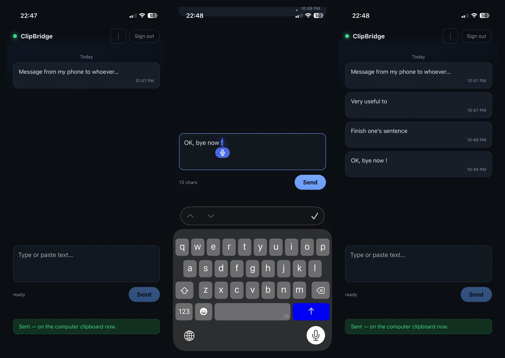

# ClipBridge

Send text from a browser on your phone straight to a computer's clipboard, ready to paste anywhere. No phone app, no account, no cloud — just a small Node server on the computer and a React page on the phone that looks like a chat, but only with your messages.

Works over your LAN or over **Tailscale**.



## Quick start

```bash
npm install
npm run dev      # dev: server + vite with proxy
# or production:
npm run build && npm start
```

First run generates a token at `~/.config/clipbridge/token` and prints bookmark URLs. On the phone, open:

```
http://<computer-ip>:8787/?k=<token>
```

The token is saved in the phone's browser and stripped from the address bar, so the bookmark becomes just the host.

### Tailscale

Install Tailscale on the computer and the phone (same tailnet), then use the computer's `100.x.x.x` address or MagicDNS name:

```
http://macbook.your-tail.ts.net:8787/?k=<token>
```

Tailscale already encrypts that path, so plain HTTP is fine. For a proper HTTPS name: `tailscale serve --bg 8787`. Do **not** port-forward this to the public internet.

### Linux clipboard

- Wayland: `wl-clipboard` (`wl-copy`)
- X11: `xclip`

macOS uses `pbcopy`, Windows uses `clip` — both work out of the box.

## Features

- **Chat-style UI**: your sends appear as bubbles in a conversation thread, newest at the bottom, grouped by Today / Yesterday / Earlier.
- **Swipe to reveal actions**: swipe a bubble left to reveal **Delete** and **Resend** buttons behind it.
- **Resend**: tap a bubble or the Resend button to push that text to the clipboard again.
- **Delete one or all**: each entry can be deleted individually; a menu in the top bar offers **Delete all**, with a confirmation modal.
- **Persistent history**: stored in `localStorage`, survives browser restarts. Up to 50 entries. Nothing is lost unless you delete it manually.
- **Desktop notification** on the computer when something arrives.
- **Token auth**: a random bearer token, required on every request.
- **Mobile-first dark UI**: safe-area aware, works as a home-screen web app.

## API

| Method | Path | Auth | Description |
|--------|------|------|-------------|
| `POST` | `/api/send` | Bearer token | Body: `{ "text": "..." }`. Writes to clipboard. |
| `GET` | `/api/health` | no | Liveness check. |
| `GET` | `/api/history` | Bearer token | Server-side send log (last 200). |

The phone UI keeps its own history in the browser; the server log is optional.

## Notes

- Each computer runs its own server. The phone just keeps one bookmark per machine.
- The server must run inside a graphical session (not SSH) so it can reach the desktop clipboard.
- History is per-browser: clearing site data wipes it. There is no sync between devices by design.
